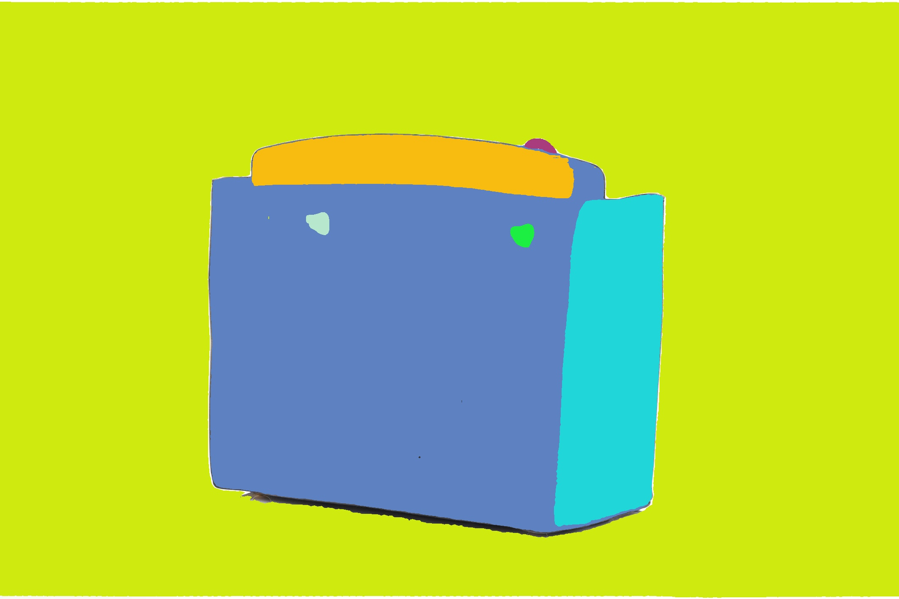
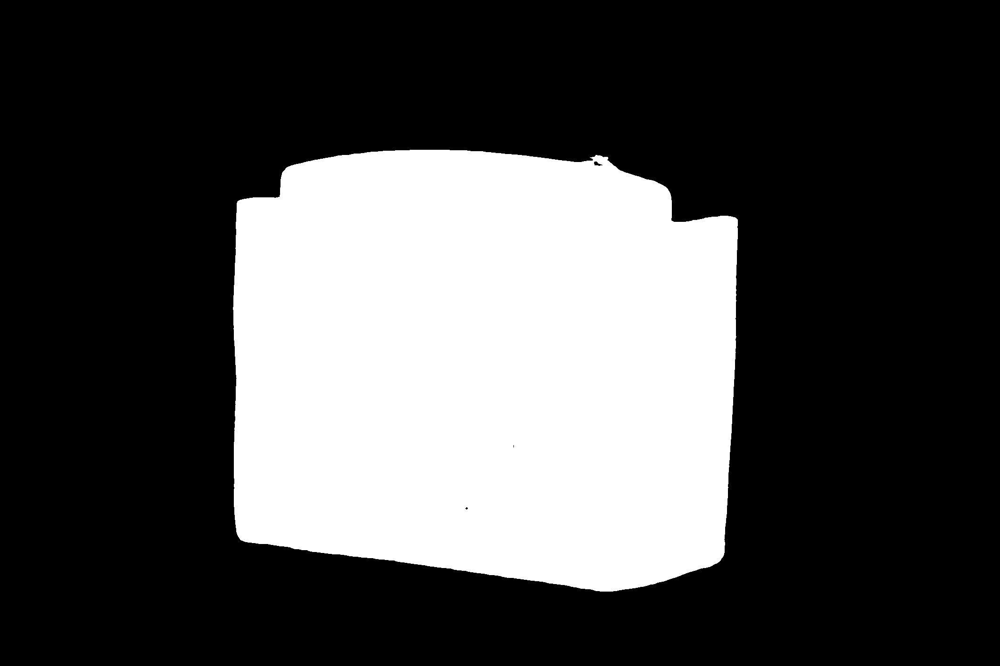
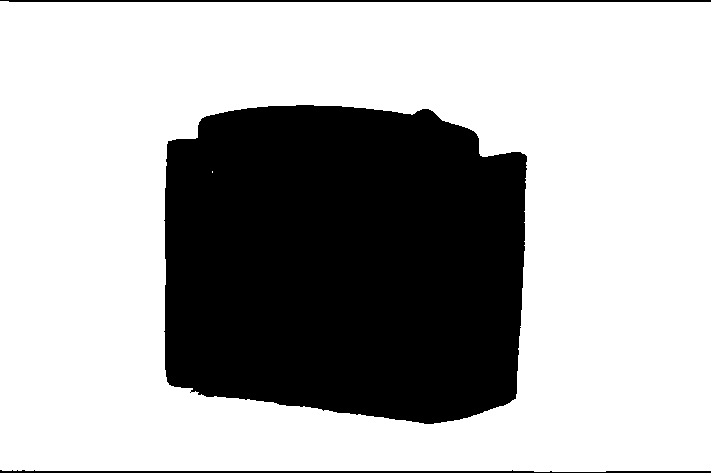
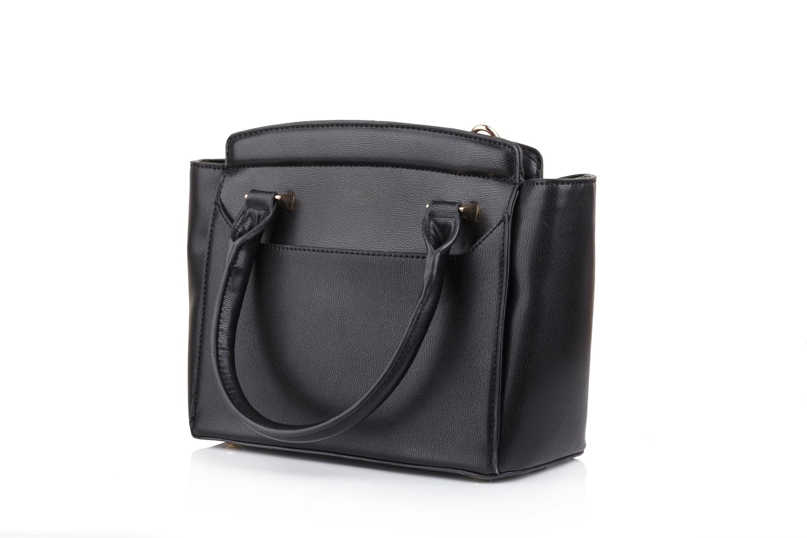

## A1_SAM_Segmentation_Demo

本範例示範使用 SAM2 對單張影像進行自動分割，並將結果輸出到 `outputs` 資料夾。

## Report

本任務將 Segment Anything Model 2（SAM2）應用於單張手提包影像，以評估其自動目標分割能力。此模型無需人工進行標註即可生成掩膜，展現了其在不同影像目標類別上的效能。

自動產生的遮罩包含多個分割候選區域，包括手提包主體、提把、金屬裝飾和少量背景區域。模型提供的IoU和穩定性評分有助於評估掩膜品質。在大多數情況下，手提包主體區域被清晰分割，邊界明確，尤其是在背景相對簡單且顏色對比度強的情況下。

然而，也觀察到一些限制。首先，小區域通常被視為獨立的目標。其次，像肩帶這樣的細小結構有時會出現分割不完整的情況，尤其是在與顏色相近的背景重疊處。第三，背景陰影有時會產生額外的掩碼，這表明 SAM2 嚴重依賴局部視覺線索而非語義理解。


## Code

```
import os
import cv2
import numpy as np

# SAM2 imports
from sam2.build_sam import build_sam2
from sam2.automatic_mask_generator import SAM2AutomaticMaskGenerator


def ensure_dir(p: str) -> None:
    os.makedirs(p, exist_ok=True)


def main():
    image_path = "images/handbag.jpg"
    out_dir = "outputs/sam2"
    masks_dir = os.path.join(out_dir, "masks")
    overlays_dir = os.path.join(out_dir, "overlays")
    ensure_dir(masks_dir)
    ensure_dir(overlays_dir)

    # Load image
    bgr = cv2.imread(image_path)
    if bgr is None:
        raise FileNotFoundError(f"Cannot read image: {image_path}")
    image = cv2.cvtColor(bgr, cv2.COLOR_BGR2RGB)

    # Load SAM2
    # config file 和 checkpoint 依你下載的版本調整
    model_cfg = "configs/sam2.1/sam2.1_hiera_l.yaml"
    checkpoint = "checkpoints/sam2.1_hiera_large.pt"

    sam2 = build_sam2(model_cfg, checkpoint, device="cuda")  # 沒 GPU 改成 "cpu"

    mask_generator = SAM2AutomaticMaskGenerator(
        sam2,
        points_per_side=32,
        pred_iou_thresh=0.88,
        stability_score_thresh=0.95,
        crop_n_layers=1,
        crop_n_points_downscale_factor=2,
        min_mask_region_area=100,
    )

    # Generate masks
    masks = mask_generator.generate(image)

    # Save masks
    for i, mask in enumerate(masks, start=1):
        m = (mask["segmentation"].astype(np.uint8) * 255)
        cv2.imwrite(os.path.join(masks_dir, f"handbag_01_mask_{i:03d}.png"), m)

    # Overlay (simple random color overlay)
    overlay = image.copy()
    rng = np.random.default_rng(0)  # 固定隨機種子，方便重現
    for mask in masks:
        color = rng.integers(0, 255, size=3, dtype=np.uint8)
        overlay[mask["segmentation"]] = color

    overlay_bgr = cv2.cvtColor(overlay, cv2.COLOR_RGB2BGR)
    cv2.imwrite(os.path.join(overlays_dir, "handbag_01_overlay.jpg"), overlay_bgr)

    print(f"Saved {len(masks)} masks to: {masks_dir}")
    print(f"Saved overlay to: {os.path.join(overlays_dir, 'handbag_01_overlay.jpg')}")
if __name__ == "__main__":
    main()
```

### 1. 輸出結果 (`outputs`)

輸出路徑為 `outputs/sam2`，其中：

- `outputs/sam2/overlays/`：原圖覆蓋上隨機顏色的遮罩結果  
- `outputs/sam2/masks/`：每一個獨立遮罩的二值圖 (白色為前景)

#### 1.1 Overlay 圖



#### 1.2 Mask 圖 (逐張列出)





---

### 2. 輸入影像 (`images`)

輸入影像放在 `images` 資料夾中，目前使用的示範圖為：



程式碼中對應的設定：

```python
image_path = "images/handbag.jpg"
out_dir = "outputs/sam2"
```


## Refrernce

參考本專案根據官方範例練習與註記的 automatic_mask_generator_example.ipynb

